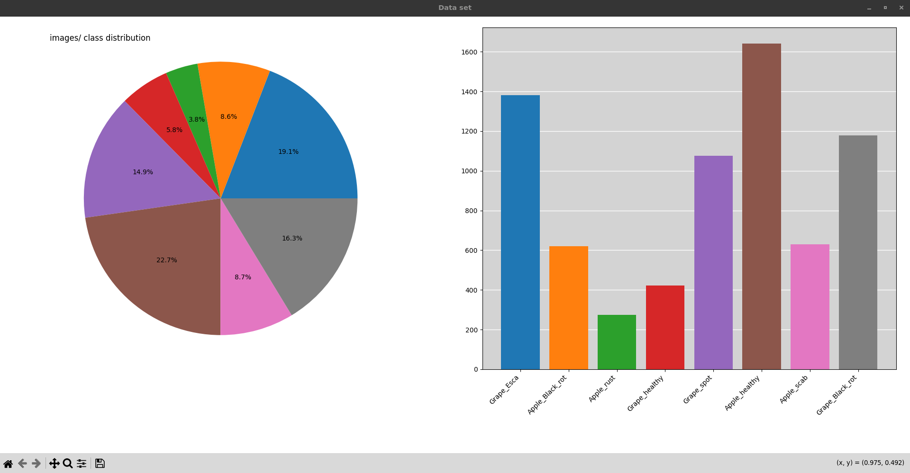
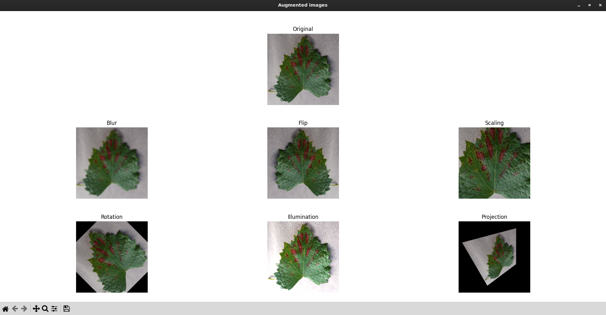
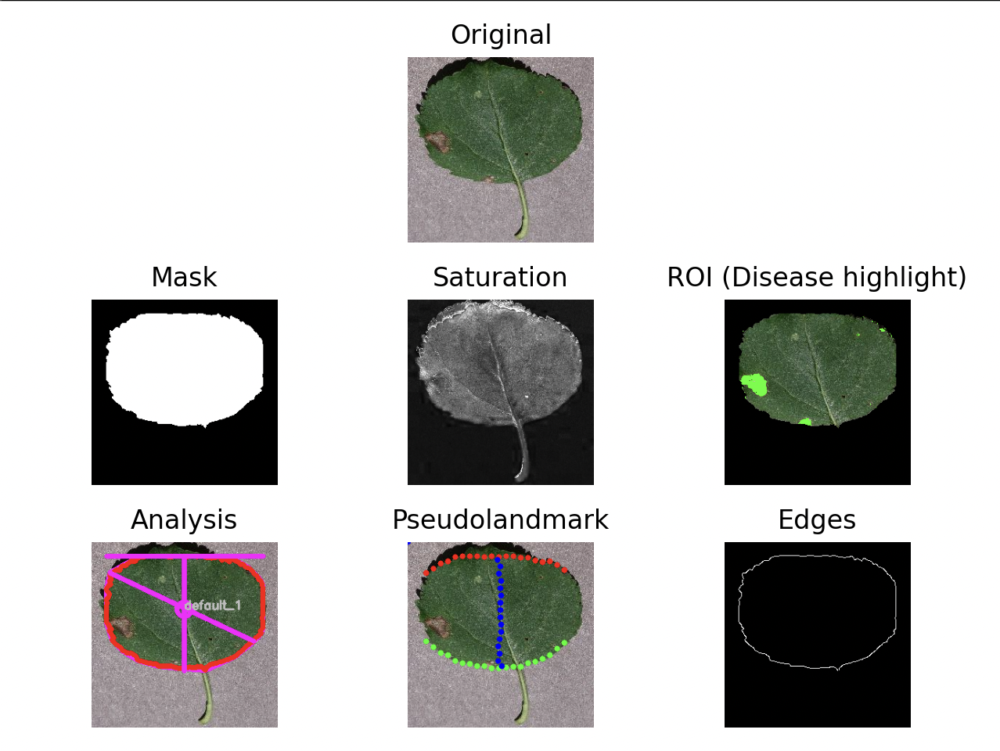

# Leaffliction

## Getting started

### Requirements

- python3.10
- make
- pip

# Distribution

The distribution program reads the specified directory and its direct 
subdirectories.

```text
$ find images/ -maxdepth 2 -type d
images/
images/Grape_Esca
images/Apple_Black_rot
images/Apple_rust
images/Grape_healthy
images/Grape_spot
images/Apple_healthy
images/Apple_scab
images/Grape_Black_rot
```

It will display one pie chart and one bar chart that show the amount of 
files per subdirectory.

```python3.10
venv/bin/python3.10 Distribution.py <data_set_directory>
```



# Augmentation

We notice that the data set is not balanced. In order to balance it, we 
will create variations of the existing images by applying different filters 
on them.

We have implemented 6 different kinds of filters :
- Blur : blurs the image
- Flip : flips the image
- Illuminate : increases the alpha of the image
- Project : applies a distortion to the image
- Rotate : rotates the image
- Scale : zooms in/out of the image

All filters have properties that are configurable in `config.py`. If 
`DISPLAY_AUGMENTED_IMAGES` is set to true, the program will open a window 
to display all augmented images.



# Transformation

This part of the program aims to extract features and highlight specific regions of interest (ROI) on the leaves, such as diseased areas, to better understand the data.

We have implemented 6 different transformations that can be applied to the images:
- **Mask (`-m`, `--mask`)** : Generates a binary region of interest (ROI) mask.
- **Saturation (`-s`, `--saturation`)** : Applies a saturation transformation to the image.
- **ROI (`-r`, `--roi`)** : Highlights the diseased areas based on the mask.
- **Analysis (`-a`, `--analysis`)** : Analyzes the region of interest.
- **Pseudolandmark (`-p`, `--pseudolandmark`)** : Extracts and displays pseudolandmarks on the leaf.
- **Edges (`-e`, `--edges`)** : Detects the edges of the region of interest.

> [!NOTE]
> If no specific filter flag is provided, **all** transformations are applied by default.

The program operates in two distinct modes depending on the provided arguments:

### 1. Single File Mode
Processes a single image and opens a `matplotlib` window to display the original image alongside the requested transformations. 

```bash
$ ./venv/bin/python3.10 Transformation.py <image_file>
```



### 2. Batch Mode
Processes an entire directory (and its subdirectories) using multiprocessing to speed up the execution. It applies the selected transformations to all valid images and saves the results in a specified destination folder. 

```bash
$ ./venv/bin/python3.10 Transformation.py -src <source_directory> -dst <destination_directory> [options]
```

**Example:** Applying only the Mask and Edges transformations to a dataset:
```bash
$ ./venv/bin/python3.10 Transformation.py -src images/ -dst transformed_data/ --mask --edges
```